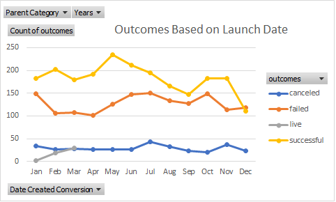

# An Analysis of Kickstarter Campaigns

## Overview of Project
Perform data analysis on Crowdfunding projects to provide insight to client, Lousie, regarding trending patterns in Kickstarter Campaigns; specifically for US Theater plays funded by Kickstarter. The initial data set contained relevant Key Performance Indicators from:

1. Twenty-one Countries
2. Nine Parent Categories
3. Forty-one Sub-categories

The relevant KPI's include:

1. The original fundraising goal
2. The total amount pledged
3. The percentage funded
4. The average donation
5. The duration of the campaign

### Purpose
Provide a visual summary of the subset data: US Theater plays funded by Kickstarter.

## Analysis and Challenges

### Analysis of Outcomes Based on Launch Date:
1. May and June have the highest success rate.
2. May, July and October have the highest failure rate.
3. January has the highest cancelation rate.
4. Failed Kickstarter campaigns have much higher fundraising goals than successful Kickstarter campaigns.

### Analysis of Outcomes Based on Goals

1. Campaigns in the two lowest donation categories, less than $1,000 and between $1,000 and $4,999 have the highest percentage successful and the lowest percentage of failures.
2. The Average Goal was $11,322
3. Failed Kickstarter campaigns have much higher goals than successful Kickstarter campaigns.

### Challenges and Difficulties Encountered

1.  The total volume of the data from the US is greater than the sum of the surrounding data. 
2.  Some difficulty was expierenced using the COUNTIFS function, resulting in an ineffecient use of time.
3.  The data showed zero canceled plays leaving a question of validity. 
4.  No live shows were recoreded in the data unitl 2017.
5.  Anual spending by country can be filtered and viewed in the following Picot table:

    
